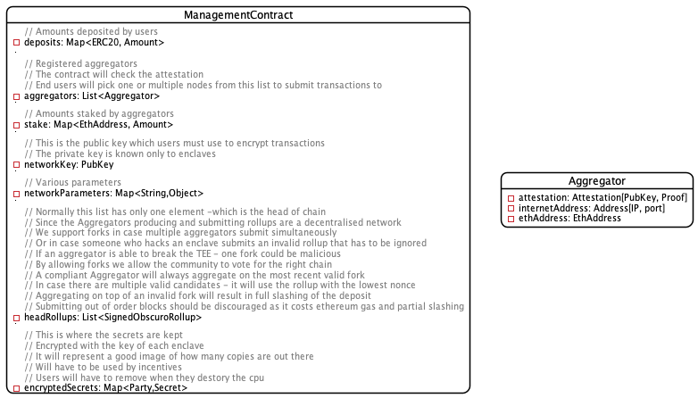
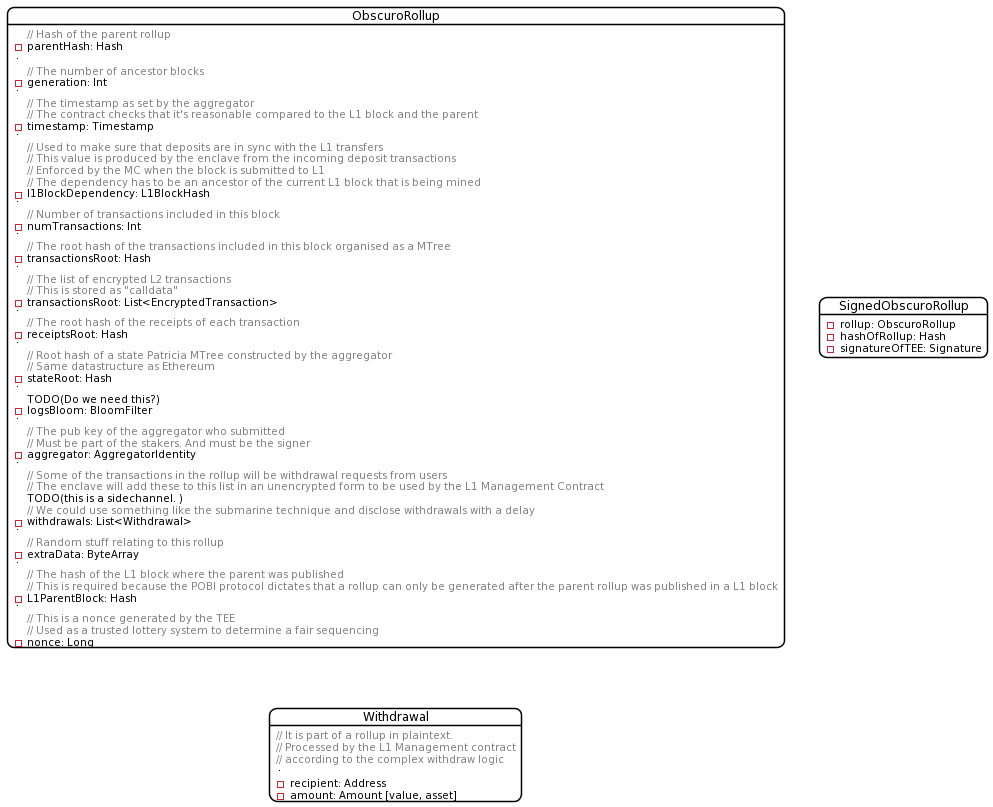
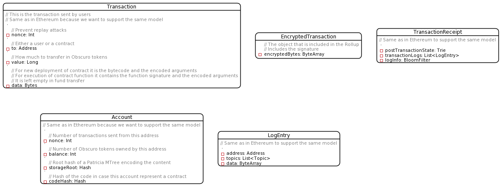

# Appendix
## Contributors
The TEN project is decentralised in nature, and this whitepaper has benefited enormously with feedback from the following contributors:
* Richard Gendal Brown
* Mike Hearn
* Moritz Platt
* Tim Brinded
* Fred Dalibard
* Stefan Iliev
* Zbigniew Czapran

Additional feedback is welcome, and all reviewers will be credited.

## Glossary
**Aggregator**
A node that participates in an L2 network and collaborates with other Aggregator nodes to manage the L2 contracts and confirm correctness of transactions. Specifically, it participates in transaction gossip, and may propose transaction rollups to be registered with the L1 blockchain.

**Attestation Constraints**
Means of controlling which software is allowed to run inside the Trusted Execution Environment.

**Automated Market Maker / AMM**
Uses liquidity pools to allow digital assets to be traded automatically and without permissions.

**Block Reward**
An amount of OBX which is given to node operators to cover their costs to validate and publish blocks.

**Enclave Key / EK**
Collection of one or more cryptographic keys used for encrypting and decrypting data unique to a specific enclave, digitally signing data and identifying a Trusted Execution Environment.

**ERC-20**
Ethereum Request for Comments 20, proposed by Fabian Vogelsteller in November 2015, is a token standard that implements an API for tokens within Smart Contracts.

**Ethereum Virtual Machine / EVM**
A virtual computer whose existence is maintained by thousands of connected real-world computers running an Ethereum client.

**Gas**
The unit that measures the amount of computational effort required to execute specific operations on the Ethereum network.

**Gas Price**
The levy imposed for every computation executed on the Ethereum network to encourage good behaviour, e.g. prevent bad actors from spamming the network.

**Genesis Enclave**
The first Trusted Execution Environment to join a new network. The Genesis enclave propagates the master seed to the other attested nodes by encrypting it with specific Trusted Execution Environment keys.

**Host**
The party controlling the physical server that runs the Trusted Execution Environment. In the threat model of typical confidential computing applications, including TEN, the host is an adversary of the system.

**L1 Management Contract**
The smart contract that runs on Ethereum and handles all L1 concerns.

**Layer 1 / L1**
The public Ethereum blockchain and network.

**Layer 2 / L2**
A second network built on top of an L1 network and dependent on it. An L2 network expands on the capabilities of the L1 network by increasing capacity or enhancing functionality.

**Maximal Extractable Value / MEV**
Participants in the network may extract value by observing user transactions and then preempting them by inserting their own transaction ahead in the processing queue and influencing the price of an asset in order to extract a profit.

**Non-Fungible Token / NFT**
A unique and non-interchangeable unit of data stored on a digital ledger.

**TEN Public Events**
Special events emitted by L2 contracts that are included in the rollups in plaintext, and are exposed to L1 contracts once rollups reach finality. It is a mechanism by which TEN can publish information. 

**TEN**
The utility token used by TEN.

**Off-Chain**
Activity happening away from the Layer 1 blockchain.

**Optimistic Rollup**
Optimistic rollups assume that all transactions are valid and submit batches without performing any computation. They include a challenge period during which anyone can dispute the legitimacy of the data contained in a batch. If a fraudulent transaction is detected, the rollup executes a so-called fraud proof and runs the correct transaction computation using the data available on Layer 1.

**Over-the-counter / OTC**
A venue to provide bespoke financial agreements or options negotiated between counterparties as opposed to being listed on an exchange.

**Patricia Tree Root**
A Patricia Tree (or Trie), is a data structure used in the Ethereum model to represent the receipt trie, the world state trie, the account storage trie, and the transaction trie. Only the root node of the trie is stored in the ethereum block, and it represents a single cryptographic proof for the entire state.

**Proof Of Block Inclusion / POBI**
TEN's novel decentralised round-based consensus protocol based on a fair lottery and on synchronisation with the L1 designed for L2 rollups.

**Rollup**
L2 solutions that perform transaction execution outside the main L1 chain, but post transaction data on L1. A rollup is a batch of transactions that were executed by the L2 Verifiers.

**Root Provisioning Key / RPK**
A cryptographic key randomly created and retained by Intel. It is the basis for how the processor demonstrates that it is a genuine Intel SGX CPU at a specific trusted computing base.

**Root Sealing Key / RSK**
A cryptographic key that is unique to an enclave which that enclave uses to encrypt and decrypt data stored outside the enclave boundary.

**Sequencer**
A sequencer is the selected Aggregator which builds a rollup in a round.

**SGX**
Software Guard Extensions, a technology provided by Intel, a major CPU manufacturer. An SGX CPU has an area for encrypted computation, which the operator cannot access, secured by a private key burnt into the CPU during manufacture.

**Smart Contract / Contract**
A user application running on a blockchain network which holds data or state, responds to user commands, and may store and manage assets or money.

**Stake**
A non-negligible amount of value which is given over to an activity or process to demonstrate commitment to follow the rules for that activity or process.

**Trusted Execution Environment / TEE**
An environment where contracts may be managed in a deterministic, repeatable and auditable way, based on a set of trust dependencies.

**Trusted computing base / TCB**
 The set of computing technologies that must be working correctly and not be malicious or compromised for a security system to operate.

**Utility Token**
Tokens which are intended to provide digital access to an application or service.

**Verifier**
A _light_ L2 node which observes transaction rollups published to the L1 blockchain, and can participate in possible disputes. Any Verifier can become an Aggregator by registering on the L1 contract and pledging some stake.

**ZK-rollups**
Zero knowledge rollups generate cryptographic proofs that can be used to prove the validity of transactions.

## Data Model
This diagram shows the data structure for the Management Contract and Aggregator:

This diagram shows the data structure for the rollup and withdrawal:

This diagram shows the data structure for the transactions and account:

## Design Alternatives
This section describes alternatives considered and discarded.

### Alternative L1 Deposit management
On a high level, a user has to deposit ERC tokens on the L1 Management Contract, and the same amount has to be credited to the user's account on TEN. This is not straightforward since finality is probabilistic.
One option to achieve this is to wait a number of L1 blocks for confirmation. This has some clear disadvantages.

Another option is to introduce a dependency mechanism between the L2 rollup and the L1 blocks. Basically, the L2 transaction that credits the TEN account will be in an L2 rollup that will only be accepted by the Management Contract if the dependency is part of the ancestors of the current block.  This option is discarded because in the case where the L1 deposit gets reorganised away before the rollup is created, the rollup which contains the L2 deposit transaction is invalidated.

### Alternative L1 Theft Prevention
There is a pool of liquidity stored in the L1 Bridge contract, which is controlled by the group of TEEs who maintain the encrypted ledger of ownership. Some users will want to withdraw from the L2 and go back to L1, which means the Management Contract will have to allow them to claim money from the liquidity pool.

In case one of the Aggregators is able to hack the TEE, they will be able to produce a proof that they own much more and thus run with it.

To solve this we have a couple of options.
We could organise the Aggregators in a BFT setup, and require that 2/3 of them sign over each rollup. The major disadvantage with this approach is that the finality of an L2 transaction will depend on both the BFT finality and the L1 finality. Another disadvantage is that a determined hacker with the means to break secure hardware could also amass the majority of staking power and be unchallenged.

Another option with a better trust model is to introduce a challenge mechanism similar to the optimistic rollups. The disadvantage is that it introduces a delay, and a concept of probabilistic finality.

The data structure containing the rollups is a chain that can have multiple heads. The Management Contract cannot evaluate which one is correct because it cannot execute the transactions inside. But there are some simple rules that can be applied. For example, if a branch does not progress for N blocks it is considered dead. If at the moment of withdrawal there is only a single active head rollup, then all the system has to do is wait for a reasonable number of blocks (20-50) to ensure that there is no censorship attempt on L1. If there is a fork, then the number of blocks has to be increased to allow one of the forks to die out naturally. If it does not then all withdrawals will be locked, and the contract will enter a special procedure.

### Alternative Revelation Options
The solution will reveal all transactions after one year through a key-rotation process. An alternative policy could be to specify a ratio of transactions (e.g. 1%) are revealed either immediately or subsequently. Illegal transaction detection then becomes risk-based, but the ratio cannot be high enough to be a disincentive and yet still provide utility.

### Alternative Nonce Generation
The Aggregator host must not be able to repeatedly submit the rollup proof to the TEE to get a new random nonce, and thus achieve a low nonce in order to win the Aggregator selection round. Monotonic counters were considered but an alternative is to make the nonce deterministic. The nonce is deterministically derived from the L1 block hash combined with the public key of the enclave. This achieves the same purpose of being a fair lottery assuming there is no collusion between L1 miners and L2 Aggregators. Even if there was collusion, the cost of gaming the L1 hash might be too high in a proof of work network. In a _Proof of Stake_ network, on the other hand, collusion with L1 would pretty much mean that each round the L1 winner will also win the L2 round.

### Alternative Privacy Revelation
There are several options for revealing private data to allow law enforcement agencies to prosecute illegal behaviour and deter criminals from taking advantage of TEN's privacy features:
* Not make a provision to reveal on the basis that TEN is a platform and is un-opinionated on what it is used for.
* The transaction encryption key can be rotated and revealed periodically with a delay, such that any interested party can view all transactions. This is the solution we chose, but with some application-level flexibility.
* A governance committee can approve some data mining enclaves that will have access to the shared secret and output suspicious activity.

From the outset TEN will rotate the encryption key every year and reveal historic keys in the first phase, and decide later if additional mechanisms are required. A case-by-case revelation based on authority demands is time-consuming and prone to political interference. It is also difficult to determine objectively what is a bona-fide authority which introduces a political dilemma.

[Page history]({{ site.github.repository_url }}/blame/main/{{page.path}})
