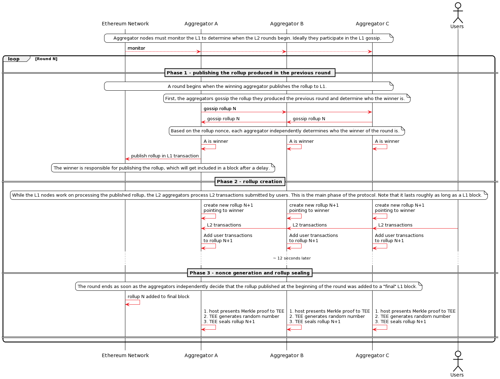
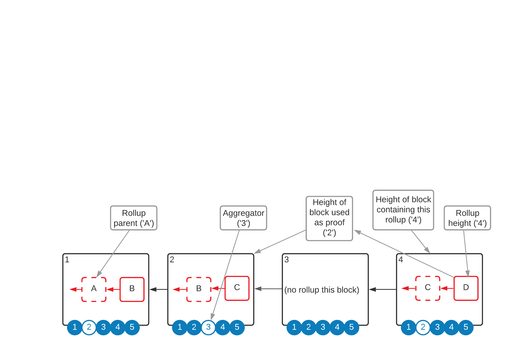
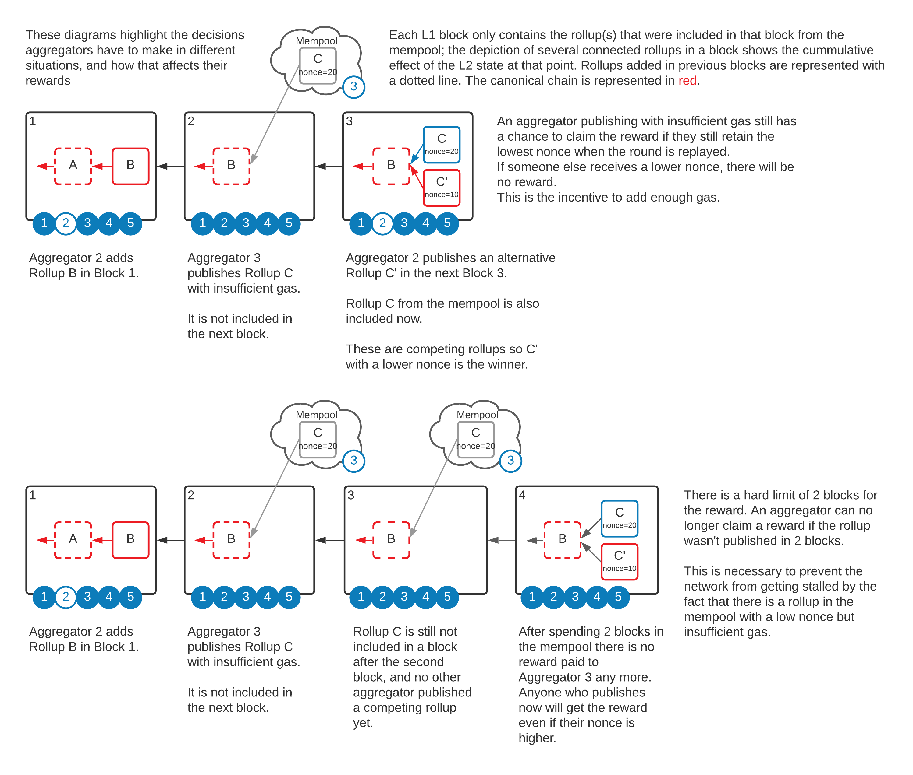
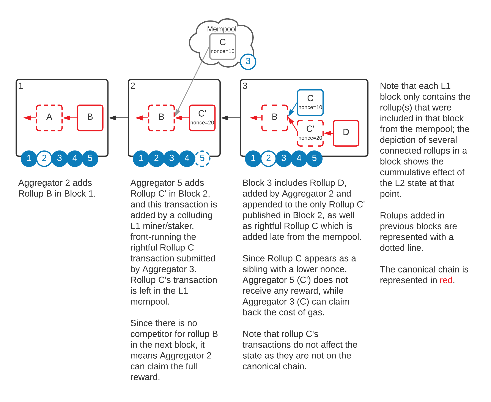

# Consensus - Proof of Block Inclusion
TEN uses a novel decentralised round-based consensus protocol based on a fair lottery and synchronisation with the L1, designed explicitly for L2 rollups, called _Proof Of Block Inclusion_ (POBI). It solves, among others, the fair leader election problem, which is a fundamental issue that all decentralised rollup solutions have to address. POBI is inspired by [Proof Of Elapsed Time](https://www.investopedia.com/terms/p/proof-elapsed-time-cryptocurrency.asp).

## High-Level Description
The high level goals of the POBI protocol are:

1. Each round, distribute the sequencer function fairly among all the active registered Aggregators.
2. To synchronise the L2 round duration to L1 rounds. Because the L1 is the source of truth, the finality of the L2 transactions is dependent on the finality of the L1 rollup transaction that includes them, which means there is no advantage in publishing multiple rollups in a single L1 block. It is impossible to decrease the finality time below that of the L1, and, on the other hand, publishing L2 rollups less frequently means that L2 finality is unnecessarily long. The optimum frequency is to publish one rollup per L1 block.

To achieve fairness, the POBI protocol states that the TEE can generate one random nonce each round, and the winner of a round is the Aggregator whose TEE generates the lowest random number from the group. The TEEs generate these numbers independently and then gossip them. The Aggregators who do not win the round, similar to L1 miners, respect this decision because it is rational to do based on the incentive mechanism. If they choose to not respect the protocol, they are free to submit a losing rollup to the L1, which is ignored by all compliant Aggregators, meaning such an Aggregator has to pay L1 gas and not get any useful reward.

The second goal is achieved by linking the random nonce generation, which terminates a round, to the Merkle proof of inclusion of the parent rollup (which exists as a transaction in the L1 transaction Patricia trie) in an L1 block. This property is what gives the name of the protocol. This means that an Aggregator can obtain a signed rollup from the TEE only if it can show the rollup is based on a published rollup in a prior L1 block. Furthermore, this feature links the creation of L2 rollup to an L1 block, thus synchronising their cadence.

A party wishing to increase its chances of winning rounds must register multiple Aggregators and pay the stake for each. The value of the stake needs to be calculated in such a way as to achieve a right decentralisation and practicality balance. 

It is straightforward for all the other Aggregators to verify which rollup is the winner by comparing the nonces and checking that the rollup signature is from an approved Aggregator.

Note that the L1 Management Contract is not checking the nonces of the submitted rollups, but it checks that the block inclusion proof is valid. The L1 contract rejects rollups generated using a proof of inclusion that is not an ancestor of the current block.

A further issue to solve is to ensure that the host cannot repeatedly submit the proof to the TEE to try to get a lower nonce, explained [here](#preventing-repeated-random-nonce-generation).

## Typical Scenario
1. A new round starts from the point of view of an Aggregator when it decides that someone has gossiped a winning rollup. At that point, it creates a new empty rollup structure, points it to the previous one, and starts adding transactions to it (which are being received from users or by gossip).
2. In the meantime, it closely monitors the L1 by being directly connected to an L1 node.
3. As soon as the previous rollup was added to a mined L1 block, the Aggregator takes that Merkle proof, feeds it to the TEE, who replies with a signed rollup containing a random nonce generated inside the enclave.
4. All the other Aggregators do roughly the same thing at the same time.
5. At this point (which happens immediately after successfully publishing the previous rollup in the L1), every Aggregator has a signed rollup with a random nonce which they gossip between them. The party with the lowest nonce wins. All the Aggregators know this, and, after a short waiting period, a new round starts.
6. The winning Aggregator has to create an Ethereum transaction that publishes this rollup to L1.

Note that by introducing the requirement for proof of inclusion in the L1, the cadence of publishing the rollups to the block times is synchronised. Also, note that the hash of the L1 block used to prove to the TEE that the previous rollup was published is added to the current rollup such that the Management Contract and the other Aggregators know whether this rollup was generated correctly.

The following diagram depicts this sequence:


## Notation
There are six elements that define a rollup :

1. The rollup parent.
2. The rollup height (Nth generation).
3. The Aggregator who generated it.
4. The height of the L1 block used as proof (L1_Proof_Height).
5. The height of the L1 block that includes this rollup (L1_Block_Height).
6. The nonce.

The following diagram depicts these elements:


The notation is the following: _R_$Rollup_Height[$Aggregator, L1_Proof_Height, L1_Block_Height, $Nonce]_.

Note that the value of _L1_Proof_Height_ can only be lower than _L1_Block_Height_.

Example: _R_15[Alice, 100, 102, 20]_ means the rollup height is 15, the aggregator is _Alice_, the height of the L1 block used as proof is 100, the height of the L1 block that included the rollup is 102, and the nonce equals 20.

## The Canonical Chain
The POBI protocol allows any Aggregator to publish rollups to the Management Contract, so short-lived forks are a normal part of the protocol. The forks cannot be long-living during normal functioning because the TENVM running inside the TEE of every node deterministically selects one of the forks as the canonical chain and only appends a rollup on top of that. 

Because the logic is identical and attested on all nodes and the TEEs receive all the relevant content of the L1 blocks (which means they process the same input data), there cannot be any competing forks more than one rollup deep unless there is a hack.

The rules for the canonical chain are the following:
1. The genesis rollup is part of the canonical chain and will be included in an L1 block by the first Aggregator.
2. An L1 block containing a single rollup whose parent is the head rollup of the canonical chain included in a previous L1 block is on the canonical chain if no other rollup with the same parent was included in an earlier block. Any other sibling rollup included in a later block is not on the canonical chain. This is the _Primogeniture_ rule, where a rollup is born when included in an L1 block.
3. If an L1 block contains multiple sibling rollups created in the same round using the same L1 proof, the one with the lower nonce is on the canonical chain.
4. If an L1 block contains multiple sibling rollups created using different L1 proofs, the one created using the more recent proof is on the canonical chain.

[comment]: <> ([TODO - diagram depicting these scenarios])

Using the notation, for the same _Rollup_Height_, the rollup on the canonical chain is the one with:
1. The lowest L1_Block_Generation. 
2. In case there are multiple matches, use the highest L1_Proof_Generation. 
3. In case there are multiple matches, use the lowest nonce.

Given that the nonce is a random number with sufficient entropy, we assume there cannot be a collision at this point during normal functioning. In the situation where it happens, the rollup on the canonical chain will be the one with the lowest hash.

## Preventing Repeated Random Nonce Generation
In phase 3 of the protocol, the TEE of each Aggregator generates a random nonce which determines the winner of the protocol. This introduces the possibility of gaming the system by restarting the TEE and generating multiple numbers.

The solution proposed by TEN is to introduce a timer in the constructor upon every startup of the enclave. A conventional timer, based on the clock of the computer, is not very effective since the host can game it. Instead, the enclave must calculate serially (on a single thread) a large enough number of SHA256 hashes, which it would not be able to do faster than an average block time even on powerful hardware.

This solution is effective since the code is attested and does not rely on any input from the host.

A node operator wanting to cheat would restart the enclave and quickly feed it the proof of inclusion, only for the enclave to process it after 15 seconds, which means the operator has already missed the time window for that rollup.

This built-in startup delay is also useful in preventing other real-time side-channel attacks, which could be used for MEV.

## Aggregator Incentives
All successful decentralised solutions need a robust incentive mechanism to keep the protocol functioning effectively.

Compared to a typical L1 protocol, there is an additional complexity to consider. In an L1 like Bitcoin or Ethereum, once a node gossips a valid block, all the other nodes are incentivised to use it as a parent because they know everyone does that too. In an L2 decentralised protocol like POBI, there is an additional step: the publication of the rollup to L1, which can fail for multiple reasons. Furthermore, the incentive design must also consider the problem of front-running the actual rollup. For a rollup to be final, it has to be added to an L1 block, which is where an L1 miner or staker can attempt to claim the reward that rightfully belongs to a different L2 node.

Note that rollup finality will be covered extensively in the [TEN - Ethereum interaction section](./ten-ethereum-interaction).

The high-level goal is to keep the system functioning as smoothly as possible and resist random failures or malicious behaviour while not penalising TEN nodes for not being available. We believe that penalties for availability increase the barrier of entry, and thus make the system centralised over the long term. 

TEN introduces the concept of _claiming rewards_ independently of the actual canonical rollup chain. The great advantage is increased flexibility in aligning incentives at the cost of increased complexity. Rewards can be awarded in full, split between Aggregators or just enough to cover the cost of gas.

To achieve this, the protocol has to maintain a pool of tokens. Users will pay fees into this pool, while nodes will be paid from it. During bootstrapping, the protocol will have the ability to add newly minted tokens to the pool. Once the network picks up, the protocol will be able to burn excess tokens.

Note, that an important assumption is that the reward from publishing a rollup will never exceed twice the gas cost.

These are the Aggregator rewarding rules:

1. The first Aggregator to successfully published a rollup without competition in an L1 block will get the full reward. This is the most efficient case that is encouraged.
_Note: Competition means another rollup with the same parent._ 

2. If multiple rollups generated with the same L1 proof and different nonces are published in the same block (the target block), the one with the lowest nonce is on the canonical chain, but the reward is split between them in a proportion of 75/25 (this ratio is indicative only). The reason for this rule is that it incentivises Aggregators to gossip their winning rollup such that no one else publishes at the same time.
    - There is no incentive for the losing Aggregator to publish as 25% of the reward will not cover the cost of gas, so they will make a loss.
    - There is an incentive for the winning Aggregator to gossip the rollup to everyone else to avoid having this unwanted competition.
    - In case of a genuine failure in gossip (i.e. beyond designed latency), the losing Aggregator receives something. This is to reduce the risk of Aggregators waiting more than necessary to receive messages from all the other Aggregators.

3. If multiple sibling rollups generated using different L1 blocks as proof are included in the same block, the one created with the most recent proof receives the full reward. 

     The original winning rollup that did not get published immediately does not receive any reward since more recent competition exists. This rule is designed to encourage publishing with enough gas, such that there is no risk of competition in a further block. The rule also encourages Aggregators to not wait for rollups published with insufficient gas or not at all. 

     This mechanism ensures rounds reset when new L1 blocks are available and the reward is up for grabs. An actor controlling multiple Aggregators with malicious irrational behaviour can only slow down the ledger because the rational actors will publish the rounds they win.

4. If two consecutive L1 blocks include each a rollup with the same height created from the same L1 proof, but the rollup from the second block has a lower nonce, split the reward evenly between the two Aggregators.

     _Note that the rollup with the higher nonce is on the canonical chain._

     The reason for this rule is that this scenario is possibly the result of rollup front-running, which is thus discouraged as the frontrunner is consuming precious Ethereum gas and the reward will always be less than the cost.

     The even splitting of the reward also encourages the Aggregator that wins a nonce generation round to publish as soon as possible, because publishing a block later will at best result in a small loss.

5. If two sibling rollups created from the same L1 proof are published more than one block apart, where the first published rollup has a higher nonce, then pay the reward in full to the first published rollup. The reason for this rule is that the winner most likely added too little gas, and someone else spotted the opportunity and contributed to earlier finality, which is rewarded. It adds an incentive to monitor gas prices and pay enough to ensure their rollup is published.


The following diagrams depict some of the rewarding rules:


The following diagram depicts rules in the case of front-running:


This is python-like pseudocode to calculate the rewards that can be claimed by an _Aggregator_ for a _Rollup_Height_. Note that it is not comprehensive, and there may be many competing aggregators.

```python
# The rollup height for which we calculate the rewards
height = N

# 'heightN_L1_Blocks' is a list of all L1 blocks starting with the _L1_Block_Height_ of the head 
# of the canonical chain of the previous generation, until the block where you encounter the 
# first valid rollup of _Rollup_Height_ plus one extra L1 block.
heightN_L1_Blocks = calculateBlocks()

# List of rollups of height N found in the last block
rollups_in_last_block = heightN_L1_Blocks[-1].rollups.filter(r.height == height)

# List of rollups of height N found in the target block
rollups_in_target_block = heightN_L1_Blocks[-2].rollups.filter(r.height == height)

if rollups_in_target_block.size == 1 and rollups_in_last_block.size == 0:

    # There is no competition for the target rollup
    fullRewardTo(rollups_in_target_block[0].aggregator)

elif rollups_in_target_block.size == 1 and rollups_in_last_block.size == 1:

    # There is competition for the target rollup in the next rollup
    # Which means there is suspicion of frontrunning
    target_rollup = rollups_in_target_block[0]
    competition_rollup = rollups_in_last_block[0]
   
    if competition_rollup.L1_Proof_Height == target_rollup.L1_Proof_Height and competition_rollup.nonce < target_rollup.nonce:
        # This is possibly front-running or failure to gossip
        # All parties involved in this will make a small loss
        partialRewardTo(target_rollup.aggregator, '50%')
        partialRewardTo(competition_rollup.aggregator, '50%')
    else:
        # The target has the lower nonce or is generated with a different proof
        fullRewardTo(target_rollup.aggregator)

elif rollups_in_target_block.size == 2:
    # Two competing rollups in the target block
    # This is not a front-running situation, so eventual rollups published in the next block do not matter
    rollup1 = rollups_in_target_block[0]
    rollup2 = rollups_in_target_block[1]

    if rollup1.L1_Proof_Height == rollup2.L1_Proof_Height:

        # According to rule #2 the competing rollups will split the reward 
        if rollup1.nonce < rollup2.nonce:
            partialRewardTo(rollup1.aggregator, '75%')
            partialRewardTo(rollup2.aggregator, '25%')
        else:
            partialRewardTo(rollup1.aggregator, '25%')
            partialRewardTo(rollup2.aggregator, '75%')

    elif rollup1.L1_Proof_Height > rollup2.L1_Proof_Height:

        # According to rule #3 the rollup generated with the more recent proof gets the reward 
        fullRewardTo(rollup1.aggregator)
   
    else:
        # According to rule #3 the rollup generated with the more recent proof gets the reward 
        fullRewardTo(rollup2.aggregator)
        
else:
    pass
```

_Note that these rules are subject to adjustment based on production observations._


## Rollup Evolution

