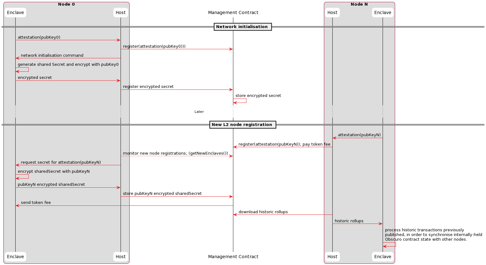
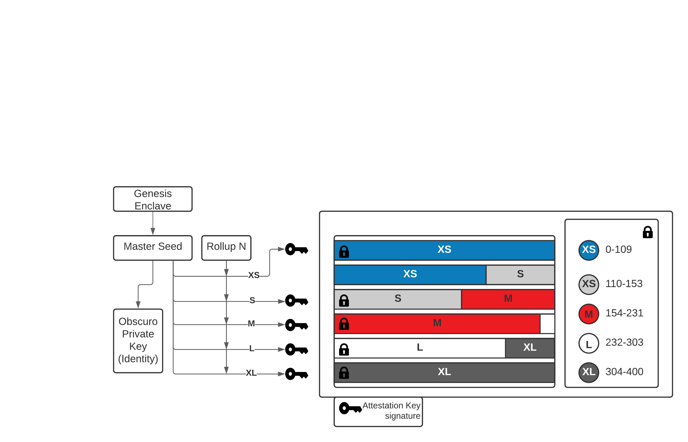

## Cryptography
This section covers the various cryptographic techniques used by TEN.

### Master Seed
CPU manufacturers provision every TEE with one or multiple keys, the _Enclave Key_ (EK). These keys are used for digitally signing messages and identifying a TEE. They are also used for encrypting data that only that particular hardware TEE can decrypt. To achieve the goals of a collaborative, decentralised network like TEN, all the TEEs have to work on the same set of transactions, which means they must all decrypt them.

The first enclave, called the _Genesis Enclave_, generates a 256bit random byte array called the _Master Seed_ inside the encrypted memory space. It encrypts this seed with the _EK_ and sends it to the Management Contract to be stored there, as well as storing it locally on the host server.

### Sharing the Master Seed
After proving their attestation, subsequent nodes receive that secret _Master Seed_ encrypted with their key. The medium over which they receive the data is the Management Contract to ensure maximum data availability.

Before obtaining the shared secret, the L2 nodes must attest that they are running a valid version of the contract execution environment on a valid CPU.

_Note: The solution assumes that attestation verification can be implemented efficiently as part of the  Management Contract. This is the ideal solution since it makes the contract the root of trust for the L2 network._

The sequence for node registration is shown in the following diagram:

An L2 node invokes a method on the Management Contract to submit their attestation, verifying it and saving this request. Then, another L2 node (which already holds the secret key inside its enclave) responds by updating this record with the shared secret encrypted using the public key of the new TEE. Whichever existing L2 node replies first, signed by the enclave to guarantee knowledge of the secret, receives a reward.

_Note: This solves several problems; the Management Contract provides a well-known central registration point on the Ethereum network, which can store the L2 shared secret in public with very high availability, and existing L2 nodes are compensated for their infrastructure and L1 gas costs to onboard new nodes._

### Generating Keys
The TEEs use the shared secret to generate further asymmetric and symmetric keys used by users to encrypt transactions and by the enclaves themselves to encrypt the content of the rollups.

Each enclave uses this master entropy to generate additional keys deterministically:

1. A public/private key pair is used as the identity of the network. The public key is published to L1 and used by clients to encrypt the signed TEN transactions and is referred to as _TEN_Public_Key_
2. A set of symmetric keys used by the TEEs to encrypt the transactions which will stored on the L1 blockchain in rollups.

_Note: When submitting a rollup, each enclave signs it with the key found in their attestation (the _AK_)._

### Transaction Encryption
One of the explicit design goals of TEN is to help application developers achieve their privacy requirements while giving them the tooling to disincentivise their users from using the application for illegal behaviour such as money laundering.

When deploying a contract to TEN, the developer has to choose one of the predefined revealing options:

* _XS_ - 12 seconds (1 block)
* _S_ - 1 hour (3600/12 = 300 blocks)
* _M_ - 1 day (24 * 3600/12 = 7200 blocks)
* _L_ - 1 month
* _XL_ - 1 year

_Note: These periods are counted in L1 blocks and are indicative._

One of these options is chosen by default for applications that do not explicitly specify one. Based on the chosen period, transactions submitted to that application can be decrypted by anyone after that time delay.

The protocol deterministically derives 5 symmetric encryption keys for each rollup, derived from the master seed, the reveal option, the running counter for that option, and the block height, such that all TEEs in possession of the master secret can calculate the same encryption key.

For example, application _FooBar_ has a reveal setting of _M_ (1 day). Alice submits a transaction (encrypted with the _TEN_Public_Key_) _Tx1_ on the 1st of February and another _Tx2_ on the 2nd of February. Inside the TEE, they are decrypted and executed. When the rollup is generated, all transactions sent to applications with the same reveal option are bundled together by the Aggregator, compressed, and encrypted with the _Encryption_Key(Master_Seed, Reveal_Option, Counter, Block_Height)_. 

The transaction blob is formed by concatenating all the encrypted intervals without any delimiter to prevent information from leaking. Then, separately from the transaction blob, a data structure is created containing each option's start (index) position. This map is also added to the rollup after being encrypted with a separate key that is not revealed.

This is depicted in the following diagram:

_Note that the predefined reveal periods are preferable to each application choosing a custom period, as it simplifies computation and the number of keys that have to be managed._

### Revelation Mechanism
The mechanism described above ensures that TEN transactions are encrypted with different keys, which can be revealed independently.

The other piece of the puzzle is the mechanism that controls the actual reveal process. On a high level, the platform needs a reliable way to measure the time that cannot be gamed by a malicious host owner.

The L1 blocks can be used as a reliable measure of average time. The rule is that after enough blocks have been added on top of the block that includes the rollup with the encrypted transactions, any user can request the encryption key and the position of the transactions they are entitled to view from the TEE of any TEN node.

A malicious node operator wanting to have a peek at transactions before the designated time has passed can try to _fast-forward_ time by creating an Ethereum fork and mining blocks with well-chosen timestamps such that difficulty keeps decreasing.

The solution to this problem is straightforward. TEN TEEs fully understand the Ethereum protocol and receive all L1 blocks as part of the POBI protocol, which allows them to verify that the blocks are valid, but they cannot know wheter this is the canonical Ethereum chain or a malicious fork designed to fast-forward time. To address this, TEN hard-codes a minimum difficulty lower than the average network difficulty for the last year, but much higher than any single actor can achieve. This will prevent the node operator from speeding up time.

### Cryptographic Algorithms
TEN makes the same choices as Ethereum for hashing and signing algorithms and uses the same elliptic curve. 

Communication with TEEs and the encryption algorithms are not yet defined. 

_Note: There might be a more efficient way to achieve the same high-level goals, and we are considering different other options._