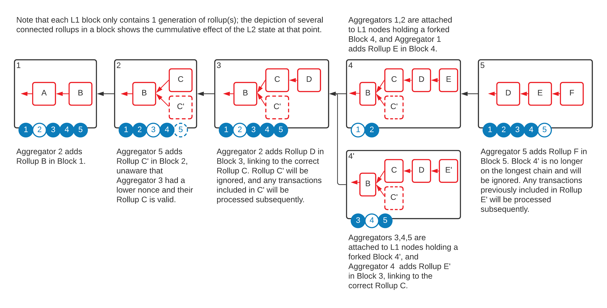

# Detailed Technical Design

## Shared Secret
A CPU manufacturer provisions every TEE with one or multiple keys, the EK. These keys are used for digitally signing messages and identifying a TEE. They are also used for encrypting data that only one hardware TEE can decrypt. To achieve the goals of a collaborative network like Obscuro, all the TEEs have to work on the same set of transactions, which means they must decrypt them.

Obscuro achieves this by implementing a mechanism for attested TEEs to share 256 bits of entropy called the _shared secret_ (SS) or _master seed_.  This master seed is generated inside the first TEE to join a new network, which propagates it to the other attested nodes by encrypting it with specific TEE keys.

The TEEs use the shared secret to generate further asymmetric and symmetric keys used by users to encrypt transactions and by the enclaves themselves to encrypt the content of the rollups.

Note that high available replication of the shared secret is fundamental for the good functioning of Obscuro. There are multiple incentives built into the protocol to ensure this.

Read more about this in the detailed [Cryptography section](#cryptography).

## Account-based State
Obscuro is an account based L2 decentralised ledger system similar to the L1 Ethereum blockchain, where state is calculated independently by each node based on the canonical list of transactions. One major difference is that the account balances can only be calculated inside the TEEs and are only revealed under certain conditions.
The model is not described further in this paper because it is the same as [Ethereum Accounts](https://ethereum.org/en/developers/docs/accounts/).

The transaction and smart contract formats are very similar to Ethereum.
Confidentiality introduces a few more low level differences around the mechanics.

## Aggregators and Verifiers
There are two categories of nodes in the Obscuro network:

### Aggregator Nodes
Aggregators are the nodes in possession of the _shared secret_ who can submit rollups to the L1. To gain this privilege, these nodes must pledge a stake.

End users will send encrypted transactions to any registered aggregators who will then gossip the transactions. Every round, one of the aggregators will publish the transaction in a rollup.

Aggregators have the following functions:
* Integrate with a L1 node to monitor published blocks and to submit rollups.
* Gossip with the other aggregators registered in the management contract.
* Interact with the TEE:
    - Submit user encrypted transactions.
    - Submit signed user balance requests and encrypted responses back to the users.
    - Submit proofs of block inclusion and receive signed rollups.
* Store data encrypted by the TEE and make it available when the TEE requests it. Act as an encrypted database.

### Verifier Nodes
Verifiers are nodes in possession of the shared secret that have not pledged the stake and are not part of the aggregator gossip network. To receive the L2 transactions, they monitor the L1 network and calculate the state based on the rollups submitted there.

End users can interact with either aggregators or verifiers to receive events on submitted transactions or query their accounts' balance. Any end-user can become a verifier with minimal cost if they have compatible hardware.

Allowing these two categories lowers the bar for participation, thus making the network more robust and decentralised since more independent parties guard the shared secret. In a typical system, the more parties are given access to a secret, the more vulnerable it becomes. In the case of Obscuro, the secret is only available inside the TEE, and as long as that is secure, it cannot be obtained by anyone.

## TEE Attacks
The TEE technology and the program inside are not considered easily hackable, so the primary concern for the system is to ensure high availability.
Attacks on TEEs have occurred in laboratories, so a secondary but essential concern is to prevent ultra-sophisticated actors with the ability to hack this technology from stealing funds or breaking the integrity of the ledger.
From a high level, the solution uses an optimistic mechanism to handle such a case and penalise the culprits, rather than introduce real time delays or checks to prevent it.

There are two types of attacks that someone can execute against Obscuro:

- Read-level hacks happen when the attacker is able to extract some information from the TEE. The only way to defend against these attacks is to perform a careful audit of the code, and to keep the _Attestation constraints_ up to date. An attacker that is careful not to reveal her advantage can remain undetected.

- Write-level hacks are powerful since they enable the attacker to _write_ to the ledger and thus be able to break its integrity. A write-level hack could happen if an attacker is able to extract the enclave key and sign a hand-crafted rollup which contains an invalid withdraw instruction. This is the type of attack which is viewed as the main threat for the protocol and thus handled explicitly.

## Cryptoeconomics

All successful decentralised solutions need a strong incentive mechanism to keep the protocol functioning efficiently. Obscuro also aims to give its users a good experience by not allowing any form of "MEV". This means it must avoid the gas price bidding war we constantly see in popular blockchains.

For simplicity, this analysis focuses on the normal functioning of the network, assuming it reached adoption, and it will handle bootstrapping separately.

#### High level Requirements
* Users have to pay for transactions a fair amount. No bidding wars.
* Node operators have to be paid for their service proportional to their costs.
* Sequencers have to be paid for the Ethereum gas fees they are spending to publish the rollup and make a small profit.

#### Context
The Bitcoin incentive model is very simple. Each transaction pays a fee and on top of that each block contains a coinbase transaction, both going to the winner. If there are re-organisations of the chain, the block that makes it onto the canonical chain is the one that pays the reward, because it is in the ledger. This mechanism provides the right incentives for miners to follow the rules.
One disadvantage of this model is that fees can get very high in periods of network congestion, which degrades user experience.

Ethereum builds on top of this model to handle the complexities of Turing complete smart contract execution, by introducing a notion of _gas_ and of _gas price_, but the high level mechanics remain the same.

The incentive design for a decentralised L2 protocol must also consider the problem of front-running. For a rollup to be final, it has to be added to a L1 block, which is where a L1 miner or staker can attempt to claim the reward of a different L2 node.

#### Reward claiming

Obscuro moves away from the Bitcoin/Ethereum approach and introduces the concept of _claiming rewards_ independently of the actual canonical rollup chain.

The great advantage is increased flexibility in aligning incentives, at the cost of increased complexity.

In a nutshell, Obscuro nodes that are performing any activity according to the protocol have the possibility of submitting a transaction containing a proof which will pay them a fair amount. To achieve this, the protocol has to maintain a pool of tokens. Users will pay fees into this pool, while nodes will be paid from it. During bootstrapping, the protocol will have the ability to add newly minted tokens to the pool. Once the network picks up, the protocol will be able to burn excess tokens.

## Basic Rollup Data Structure
The management contract implements a blockchain-like data structure to hold the rollups. Each rollup points to a parent rollup, and at any time there can be multiple competing sibling rollups. Similar to L1 blockchains, it is the responsibility of the individual L2 nodes to decide which sibling is valid. The difference is that un-hacked nodes are not able to build upon an invalid rollup.

The diagram below depicts a L1 blockchain (in black), with the usual forks. Each block contains a snapshot of the state of the Obscuro rollup chain (in Red). There are 5 Obscuro nodes, each of them connected to different L1 nodes.

Note that forks are possible at both layers, and it is the responsibility of the Obscuro nodes to navigate and choose the most likely L1 block and L2 rollup.

## Cryptography
The first enclave (or a special key generation enclave), generates a 256bit master seed inside the encrypted memory space. It encrypts this seed with the EK and sends it to the management contract to be stored there.
Subsequent enclaves, after proving their attestation will receive that secret encrypted with their key. The medium over which they receive the key is the management contract, to ensure maximum data availability.

This master entropy will be used by each enclave to deterministically generate additional keys:

1. A private/public key pair which will be used as the identity of the network. The public key will be published to L1 and used by clients to encrypt the signed transactions. This will be referred as: _Obscuro_Public_Key_
2. A set of symmetric key used by the enclaves to encrypt the transactions that will be stored on the L1 blockchain.

When submitting a rollup, each enclave will sign it with the key found in their attestation (the AK).

### Symmetric key revealing

One of the explicit design goals is to help application developers achieve their privacy requirements, while giving them the tooling to dis-incentivise users from using the application for illegal behaviour such as money-laundering.

When deploying a contract to Obscuro, the developer has to choose one of the predefined revealing options.

For example:
* XS - 12 seconds ( 1 rollup)
* S - 1 hour (3600/12 rollups)
* M - 1 day (24 * 3600 /12 rollups)
* L - 1 month
* XL - 1 year

One of these options will be chosen by default for applications that don't explicitly specify one.

Each predefined period will reveal have to reveal transactions in a different cycle. The protocol will deterministically derive a symmetric encryption key from the master seed, the id of the reveal option, and the running counter for that option. All enclaves in possession of the master secret will be able to calculate the same encryption key.

Each interval for each reveal option will thus have a dedicated key _EncryptionKey(Reveal_option, Interval)_.

Signed user transactions are submitted to the network encrypted with the _Obscuro_Public_Key_. Inside the TEE, they are decrypted with the private key, and executed. When the rollup is generated, all transactions corresponding to a single option are bundled together, compressed, and encrypted with the symmetric _EncryptionKey(Reveal_option, Interval)_.

The transaction blob is formed by concatenating all the intervals without any delimiter.
Separately from the blob, a data structure is created containing the position of each individual option. This map is encrypted with a special key which is not revealed.

After enough rollups have been added, any node operator can request from the TEE the encryption key and the position of the transactions they are entitled to view.

[TODO - add more details and some diagrams.]
[TODO - diagram1: Interaction diagram ]
[TODO - diagram2: Structure of a block ]

## Proof of Block Inclusion
Obscuro uses a novel decentralised round-based consensus protocol based on a fair lottery and on synchronisation with the L1 designed for L2 rollups, called _Proof Of Block Inclusion_ (POBI). Fair leader election is a fundamental issue that all decentralised rollup solutions have to address.
POBI is inspired by [Proof Of Elapsed Time](https://sawtooth.hyperledger.org/docs/core/releases/1.0/architecture/poet.html).

### High Level Description
The high level goals of the POBI protocol are:
1. Each round, to distribute the sequencer function fairly among all the active registered aggregators.
2. To synchronise the L2 round duration to L1 rounds. Because the L1 is the source of truth, the finality of the L2 transactions is dependent on the finality of the L1 rollup transaction that includes them, which means there is no advantage in publishing multiple rollups in a single L1 block. It is not possible to decrease the finality time below that of the L1. On the other hand, publishing L2 rollups less frequently means that L2 finality will be unnecessarily long. The optimum frequency is to publish one rollup per L1 block.

To achieve fairness, the PoBI protocol states that each round the TEE can generate one random nonce and the winner of a round is the aggregator whose TEE generated the lowest random number from the group. The TEEs will generate these numbers independently and then will gossip them. The aggregators who didn't win the round, similar to L1 miners, will respect this decision because it is the rational thing to do. If they don't want to respect the protocol, they are free to submit a losing rollup to the L1, but it will be ignored by all compliant aggregators, which means such an aggregator has to pay L1 gas and not get any useful reward.

We achieve the second goal by linking the random nonce generation which terminates a round to the Merkle proof of inclusion of the parent rollup in a L1 block. This property is what gives the name of the protocol. This means that an aggregator is able to obtain a signed rollup from the TEE only if it is able to present a Merkle proof of block inclusion to the TEE. This feature links the L1 block creation to the L2 rollup creation, thus synchronising their cadence.

A party wishing to increase its chances of winning rounds will have to register multiple aggregators and pay the stake for each. The value of the stake needs to be calculated in such a way as to achieve a right decentralisation and practicality balance.

It is very easy for all the other aggregators to verify which rollup is the winner, by just comparing the nonces.

Note that the L1 management contract is not checking the nonces of the submitted rollups, but it checks that the block inclusion proof is valid.

A further issue is to ensure that the host will not be able to repeatedly submit the proof to the TEE to get a new random number.

### Typical Scenario
1. A new round starts from the point of view of an aggregator when it decides that someone has gossiped a winning rollup. At that point it creates a new empty rollup structure, points it to the previous one, and starts adding transactions to it (which are being received from users or by gossip).
2. In the meantime it is closely monitoring the L1 by being directly connected to a L1 node.
3. As soon as the previous rollup was added to a mined L1 block, the aggregator takes that Merkle proof, feeds it to the TEE who replies with a signed rollup containing a random nonce generated inside the enclave.
4. All the other aggregators will be doing roughly the same thing at the same time.
5. At this point (which happens immediately after the successful publishing of the previous rollup in the L1), every aggregator will have a signed rollup with a random nonce which they will gossip. The party with the lowest nonce wins. All the aggregators know this, and a new round starts.
6. The winning aggregator has to create an ethereum transaction that publishes this rollup to L1.

Note that by introducing the requirement for proof of inclusion in the L1, the cadence of publishing the rollups to the block times is synchronised.
Also, note that the hash of L1 block used to prove to the TEE that the previous rollup was published will be added to the current rollup. The management contract, and the other aggregators will only accept proofs from the _final_ fork. ([TODO- more details])

This sequence is depicted in the following diagram:

### Preventing repeated random number generation

In Phase 3 of the protocol, the TEE of each aggregator generates a random number which determines the winner of the protocol. This introduces the possibility of gaming the system by restarting the TEE, and attempting to generate multiple numbers.

The solution proposed by Obscuro is to introduce a timer upon startup of the Enclave, in the constructor. A conventional timer, based on the clock of the computer is not very effective since it can be gamed by the host.

The solution is for the enclave to serially calculate a large enough number of SHA256 hashes that it couldn't do it faster than 10 seconds on even a very fast CPU.

This solution is effective, since the code is attested, and does not rely on any input from the host.

This built-in delay is also useful in preventing other side channel attacks.

### Failure scenarios and incentives

The next sections will analyze different failure scenarios and how the incentives ensure good functioning.

### Non-publishing Sequencer Scenario
Compared to a typical L1 protocol, there is an additional complexity. In a L1 like Bitcoin or Ethereum, once a node gossips a valid block, all the other nodes are incentivised to use it as a parent, because they know everyone will do that as well. In a L2 decentralised protocol like POBI, there is an additional step, which is the publication of the rollup to L1, which can fail for multiple reasons.

#### Incentives for publishing

The high level goal is to keep the system functioning as smoothly as possible, and be resistant to random failures or malicious behaviour, while not penalising Obscuro nodes for not being available.

The reward mechanism implements the following rules:
1. Pay an attractive reward to the winner of the round if they publish the rollup such that it is included in the next Ethereum block.
2. Pay a minimal reward if it is included with one block delay. This reward should only cover the cost of the gas.
3. Do not pay anything to a competing aggregator that front-runs the winner, and publishes an alternative non-winning rollup. Considering that the frontrunner is consuming precious Ethereum gas, this mechanism is in effect a punishment.
   This case will manifest itself as two competing rollups for the same generation published in sequential Ethereum blocks, where the rollup published in the first block has a higher nonce.

_Note that in the latter case, to achieve smooth running, the non-winning rollup published by the frontrunner is part of the canonical chain, but it pays no reward._

As a consequence of these rules, any winning aggregator is incentivised to publish with the _gas_price_ high enough to claim the full reward.

If there is a random spike or delay and the rollup is added to the next block, they at least don't make a loss.
In such a scenario, the rest of the aggregators have two options:
- Either replay the round, and thus compete with the rollup already in the mempool.
- Start a new round on top of the previous one.

It makes more sense to go for the second option if the rollup has a good chance of being added to the next block, since the odds of receiving a lower nonce than the previous winner is quite low.

In the case of a front-running attack, rational miners will receive the gas cost back, but not make any profit, while the frontrunners will not get any reward, thus lowering the overall running cost of the network.

### Competing L1 Blockchain Forks
In theory, different L2 aggregators could be connected to L1 nodes that have different views of the L1 ledger. This will be visible in the L2 network as rollups being gossiped that point to different L1 forked blocks. Each aggregator will have to make a bet and continue working on the L1 fork which it considers to have the best chance. This is the same behaviour as any L1 node.
In case it proves that the decision was wrong it has to roll back the state to a checkpoint and replay the winning rollups.

## State Confidentiality and Transaction Submission

### State Confidentiality
The main goal of Obscuro is to protect user data. If smart contracts were completely isolated it would be fairly easy to define data access rules.

For example, for an individual (non-contract) account, the main rule could be formalised as: *"Only the account owner, or someone empowered by the owner, is allowed to query the balance of an account."*

Contract composition is more complex. DeFi enjoys massive success thanks to the ability of contracts to be combined in serendipitous ways not predicted by the contract creator.

E.g. Consider a flashloan where a user borrows 10 ETH from Aave, swaps them for 100 ABC coins on UniSwap, then swaps them for 500 DEF coins on SushiSwap, and then swaps them for 10.1 ETH on UniSwap, and then pays back the loan and makes a 0.1 ETH profit.

In this case, the flashloan contract needs to be able to query balances or to find out if it can loan a certain amount. It needs to also know the price for the ABC/BCD on a certain exchange. All this information which it needs access to, in order to perform its duties, could in theory be emitted directly or indirectly as an event to the caller of the contract. Or it could be written to the state on accounts controlled by the attacker.

In the absence of additional controls, Obscuro will allow a user to call a normal contract function confidentially, and receive the function response confidentially. If the contract is designed to allow the internal contract state to be returned, then the user will still gain visibility despite the contract state itself being restricted to TEEs. Creators of contracts deployed to Obscuro must be aware of the difference between _confidentiality of state_ and _transparency of state provided through functions_.

Obscuro will explore the following concepts:
* Each contract can whitelist contracts that can access different functions.
* Propagate access. If "Account.getBalance" can be invoked only by the owner, it means that any contract that invokes this has to originate from a message signed by the owner. This solution sounds appealing, but it needs more research to determine if this mechanism prevents important use cases.

Note that more research is needed to define a general purpose mechanism.

### Transaction Submission
Transactions created by the user wallet are encrypted with the shared public key. Only valid TEEs in possession of the private key are able to decrypt them, execute them, and see the resulted state. Still, end users who submitted a transaction must be able to receive the result.

A traditional wallet connected to a node on public blockchain is able to read any balance and display it to the user. To achieve such a similar user experience an Obscuro-enabled wallet needs to be able to submit signed requests to L2 aggregators or verifiers, and receive a response. The response needs to be encrypted with the user key and has to be a cryptographic proof linking the balance to a rollup.

Validity verification of such a proof can be done by first checking the TEE signature, then by checking that the rollup is on the canonical chain of both the L2 and the L1 chains.

The TEE virtual machine will publish events specified in contracts, unencrypted, similar to the EVM.

## Obscuro and Ethereum Interaction
Obscuro is designed as a confidential extension to Ethereum. This means that assets have to move freely between the two networks.

The Bridge contract safeguards assets that are moved to the L2.

All side-chains and L2 solutions have to come up with solutions to the mismatches between the different models of the two networks.

Obscuro delegates finality and most security concerns to the Layer 1 network. There is a single situation where a Layer 1 voting based governance event has to decide between competing, persistent rollup forks.

## Deposits
At a high level, a user has to deposit ERC tokens in the Bridge contract, and the same amount has to be credited with wrapped tokens on the user's account on Obscuro. This is not straightforward since finality is probabilistic.

Typically, this problem is solved by waiting for a confirmation period. Obscuro solves this by introducing a dependency mechanism between the L2 rollup and the L1 blocks.

The L2 transaction that credits the Obscuro account will be in a L2 rollup that will only be accepted by the Bridge contract if the L1 block dependency is part of the ancestors of the current block.

In case the L1 deposit transaction is re-organised away from the current fork, it invalidates the rollup which contains the L2 deposit transaction. See the [Data model](./appendix#data-model) section and the user interaction diagram.

The L2 transaction that notifies an Obscuro node to update the balance cannot be encrypted because the aggregator has to make a decision whether to include it in the current rollup based on the chances of the L1 block to be final.

[TODO Is there a censorship problem to this approach?]

[TODO What is the incentive of the aggregator to add the deposit?]

## Withdrawals
There is a pool of liquidity stored in the L1 management contract, which is controlled by the group of TEEs who maintain the encrypted ledger of ownership. Some users will want to withdraw from the L2 and go back to L1, which means the Bridge contract will have to allow them to claim money from the liquidity pool.

### The Rollup-Chain
If the TEE technology was completely invulnerable, the Bridge contract could just release funds based on a signature from a valid TEE.

One attack is that one of the aggregators hacks the secure enclave, and is able to produce a proof that they own more and immediately withdraw it.

The solution to this problem makes use of the blockchain data model that was introduced already.

If an attack happened, it would manifest itself as multiple forks in the L2 chain. The Bridge contract cannot evaluate which one is correct because it can't execute the transactions inside. These could be both valid forks but some bug is preventing aggregators to agree.

The simple rule to detect an honest mistake is to wait for N blocks. If a fork does not progress for N blocks it is considered dead.

A real hack event would manifest itself as multiple forked long living chains with more than N rollups. The valid aggregators would ignore the invalid fork and continue on the valid one, while the hackers would publish rollups on the invalid fork.

This is a moment when the Network Management contract has to enter a special mode where the governance token holders will have to start aggregators with valid TEEs. These new TEEs will sign over the fork they consider valid. The result will be calculated based on the weighted stake.

### Withdrawal Process
Each TEE signed rollup will contain an unencrypted list of withdrawal requests. See: [Data Model](./appendix#data-model).

The Bridge contract will keep track of these requests and will execute them at different times, based on the status of the chain.

If at the moment of withdrawal there is only a single active head rollup, then all the system has to do is wait for a reasonable N number of blocks to ensure that there is no censorship attempt on L1. (Colluding L1 nodes could prevent a valid rollup from being published just long enough to not challenge the invalid one)

If there is a rollup fork, then the number of blocks have to be increased to allow one of the forks to die out naturally. If it doesn't then all withdrawals will be locked, and the contract will enter the special procedure described above.

This mechanism ensures that as long as there is one honest participant in the market and the L1 network is reasonably censorship resistant, the funds are safe.

## Obscuro VM
Developers should be able to write smart contracts in a familiar smart contract language using familiar blockchain abstractions, or deploy existing smart contracts to Obscuro.
Obscuro supports a runtime largely compatible with the EVM.

The Obscuro VM has the following requirements:
* Obscuro wishes to use [Conclave](https://conclave.net/), which is a JVM-based SDK, so the ObscuroVM should run on top of the JVM.
* There are differences between the data structures used by Ethereum and the ones used by Obscuro, but these are not directly visible to contract creators.
* Implement data protection.
* Introduce new abstractions or primitives to reflect the data privacy requirements.
* Metering.

Note: Designing the Obscuro VM coupled with contract composability is difficult, so the first phase will implement hardcoded smart contracts.

## Privacy Revelation
There are several options for revealing private data to allow law enforcement agencies to prosecute illegal behaviour and deter criminals from taking advantage of Obscuro's privacy features:
* Not make a provision to reveal, claiming that Obscuro is only a platform and is unopinionated on what it is used for.
* The transaction encryption key can be rotated and revealed periodically with a delay, such that any interested party can view all transactions.
* A governance committee can approve some data mining enclaves that will have access to the shared secret and output suspicious activity.
* Interested authorities can submit requests for data revelation, and after review they can get access to encryption keys for various accounts or for the entire ledger.

Obscuro will rotate the encryption key every year and reveal historic keys in the first phase, and decide later if additional mechanisms are required. Making no attempt to deter illegal behaviour is unethical, and a case-by-case revelation based on authority demands is time-consuming and prone to political interference. It is also difficult to determine objectively what is a bona-fide authority.

## Front-Running Protection
A TEE that emits events and responds to balance enquires becomes vulnerable to front-running attacks. An aggregator could in theory execute a transaction from an account they control, then execute a user transaction, then execute another transaction from a controlled account, and be able to learn something.

This is much more complicated and expensive than traditional public front-running and MEV, but it doesn't solve the problem completely.

A slight delay is introduced to make this attack impractical for the aggregators, but preserve the same user experience.  The TEE will emit events and respond to balance requests only when it received proof that a rollup was included in the L1 rollup contract. That proof is easy to obtain, and it will prevent an aggregator from probing while creating a rollup.

An aggregator wishing to attack this scheme would have to quickly publish valid Ethereum blocks while executing user transactions, which is highly impractical.

## Collocation of L1 Nodes and L2 Nodes
A mechanism is considered to incentivise L1 miners to become Obscuro verifiers, and at the same time reduce the L1 gas cost to publish rollups. The idea is to have coinbase transactions in the rollup for both the L2 aggregators and the L1 miners as long as they are able to prove in the next block that they actually ran the rollup.

This mechanism would be a way to pay for inclusion in L1 using inflation, and to ensure that L1 miners work to protect the security of the L2.

In time, big L1 miners will set up an obscuro verifier node (mining pools probably mine over 95% of the blocks), as they would not want to miss out on this new free reward.

This has some interesting properties.
* If someone publishes a corrupted rollup (because they hacked the TEE), the L1 miners would not include it unless the gas was very high on it.
* Increases the community of Obscuro verifiers or even aggregators.
* Reduces the "gas" cost.

## Smart Contract Interoperability
[TODO fill or remove]

## Threat Model
Obscuro is different from traditional blockchains because data is stored and processed privately in trusted execution environments, which brings a new set of threats.

The main threat to any ledger technology is data corruption. It could take the form of stealing assets, double spending assets, or, more generally, adding illegal entries.
Leading blockchains solve this problem by implementing a _Byzantine Fault Tolerant_ (BFT) consensus between independent parties and creating incentives to ensure that anyone who breaks the rules will not be rewarded or will be penalized. The most extreme attack is a 51% attack, where the attacker somehow gains the majority and can rewrite the history. This attack manifests as replacing an existing valid transaction with a valid competing transaction. If the attacker tried to _physically_ corrupt the ledger, everyone would ignore the invalid block. All that this powerful attacker can do is _logical_ corruption. The best defense against this attack is to ensure that multiple independent powerful actors have no incentive to collude.

POBI delegates this threat to the underlying L1 blockchain - Ethereum.

TEE technology, coupled with the goals of preserving privacy and preventing MEV, adds additional threats to Obscuro. The protocol is considers possible hacks on the TEE technology and reverts to the behavior of a typical blockchain if they happen. Also, the protocol ensures that an attacker has nothing to gain and is slashed if they attempt to corrupt the ledger.
This deterrent, combined with the technical difficulty and the high cost of attacking hardware security, will ensure the correct functioning of the protocol.

### Threats to TEE Technology
It is assumed that attackers can run an aggregator on a computer with a CPU they control, and then receive the secret key and the entire ledger, and then run any possible attack on it, including those on the physical CPU.

Assuming that such attacks are successful, the attacker can limit themselves to read-level access or try to corrupt the ledger using a write-level attack.

### Read Level Attacks
There is a spectrum of severity. The least severe is a side-channel where the attacker can find some information about a specific transaction. The most severe is when the attacker can extract the encryption key and can read all transactions.

If this attacker is discrete, the information leak can continue until a software patch is published or until new hardware that removes this attack is released.

This threat is specific to Obscuro. If the attack is successful, the protocol reverts to the behavior of a typical public blockchain where all transactions are public, and MEV is possible.

### Write Level Attacks
There are a few variants of this attack.

The most severe is when the attacker impersonates a TEE and signs a rollup containing illegal transactions. If there is no withdrawal attempt in the rollup, this attack is equivalent to an L1 node publishing an invalid block. All the honest TEEs will ignore it. Even in this case, the protocol reverts to the behavior of a typical blockchain.

There is one case that needs special consideration. When the attacker impersonating an enclave attempts to withdraw funds from the Bridge contract based on invalid transactions. This is where the L1 protocol meets the L2 protocol, and the Bridge contract has to decide the validity of the request. The solution is described in detail in the POBI protocol.

### Colluding Write Level Attacks
This is an extreme attack on this protocol, where aggregators find a way to break the TEE and are colluding to steal all funds.

The defense is to have a reasonable number of active verifiers. These will detect if there is a malicious head rollup and no other valid fork is being aggregated.

Any one of them will be able to become an aggregator if the security of the L1 is uncompromised.  They will have to pay the stake, and publish a correct block. This valid fork will disable withdraws, and will trigger a governance event which will determine the truth.

### Invalid Rollup Attacks
Sequencers may publish invalid or empty rollups, but the management contract will only accept aggregators that can prove their TEE attestation, and only rollups signed by the TEE key of valid aggregator. Unless the TEE itself is corrupted, it is impossible to publish invalid rollups.

A sequencer can publish empty rollups, but that would not do much harm if there are multiple aggregators. It will just slow down the network.

## L1 Contracts
On the L1 network there are several conventional Ethereum contracts which act together as a management contract.

### Network Management
This contract is the gatekeeper for the protocol. Any node wishing to join Obscuro will have to interact with this contract and prove it is valid.

* It registers L2 nodes, verifies their TEE attestation, and manages their stakes. (Stakes are required for the aggregators who publish rollups, as an incentive to follow the protocol.)
* It manages the TEE attestation requirements. This means that the governance of the contract can decide which enclave code is approved to join.
* It manages the L2 TEEs' shared secret key so that it is available in case of L2 node failure. The L1 acts as the ultimate high availability storage. Note: This is expanded in the [Cryptography](#cryptography) section.
* It keeps a list of IP addresses for all aggregators.

### Rollup Management
This contract interacts with the aggregators.

* It determines whether to accept blocks of transactions submitted by a L2 node. E.g. the Rollup contract will not accept a rollup from an aggregator that has no stake or a valid attestation.
* It stores the encrypted L2 transactions in an efficient format.

### Bridge Management
This contract is important for the security of the solution since all value deposited by end users will be locked in this bridge.

* It acts as a pool where people can deposit assets, like fungible or non-fungible ERC tokens, which will be made available as wrapped tokens to use on the Obscuro network, and which they can withdraw later.
* In case of conflicting forks in the rollup chain, it must delay withdrawals until one fork expires, or enter a procedure to discover which fork is the valid one. This is covered in more detail in [Withdrawals](#withdrawals).
* It may be extended to manage liquidity yields.

### Explicit Governance Mechanism
The management contract is the root of trust for the L2 network. The implemented governance mechanism will control:
* The attestation requirements.
* Various parameters like the frequency of key rotation and disclosure.
* Whether to declare that there was a massive security breach and to take the appropriate measures.
* One possible measure is to command all valid enclaves to disclose the encryption keys, to allow independent verification of transactions.
* In case of a severe breach, the governance will have to select the valid ledger and freeze it such that everyone has the chance to withdraw using balance proofs.

Since Obscuro follows the rollup pattern, the L1 is the source of truth for the L2 network. Any L2 node with a valid TEE in possession of the shared secret is able to download all the rollups from the L1, calculate the entire state inside its encrypted memory, and at the same time validate all transactions.

Governance

There are two types of powers for a decentralised network
- Explicit powers exercised by a group of people using direct signing or voting.
- Powers implicit in the protocol.

Ideally, most powers should be implicit.

Bitcoin miners, for example, have some power to determine the rules, by choosing which version of the core code to install and to produce blocks with. In case there are disagreements there will be a fork and the user community will ultimately decide what value to assign to each fork. This is only a problem if the competing forks have similar mining power, and thus security.
For day to day upgrades, miners have the de-facto decision power, but in case of disagreements, it is the users who have the ultimate power through free markets.
This is currently the golden standard for decentralised governance, with advantages and disadvantages.

Obscuro aims for as much decentralisation as practically possible.

This is a list of Obscuro powers

1. The TEE attestation requirements
   This controls which software is able to process the user transactions and create the rollups.

A group of competent auditors have to carefully analyze the code that will run inside the TEE, and approve it by signing it.
The list of "approved auditors" has to be configured by someone.

This is not very different from the smart contracts security auditors, with the exception that in a public blockchain users can decide themselves which auditors they trust by using or not using those contracts.

With TEE solutions, these auditors have to be declared in the management contract, and users will use the l2 network controlled by that contract if they trust that group of auditors.
Based on the declared auditors, the smart contract will approve a proposed software.

The auditors have to be independent and reputable parties.

2. Admin of the different management contract modules
   These modules will have upgradeable parts, to cater for bugs and features.
   Whatever is upgradeable means that the "admins" have full powers over those aspects.
   a. Bridge logic
   b. Rollup logic
   c. Attestation logic

In the example above, the auditors is a fixed list. But that might not be practical, as companies might appear or disappear. The list of approved auditors has to be managed by someone who will have an even higher power.

Ideally this list should be managed through a proposal and vote process by the community without any requirement for human intervention.

Going a level deeper, the code that manages this process might need to be upgradeable, so there is someone controlling it.

3. Creating rollups
   Aggregators with attested software and hardware who have paid a stake

3. Canonical chain
   The canonical chain is not decided by the users, as with layer 1 solutions.
   It is decided by the management contract, based on the repartition of rollups.

Todo: this is the main difference between the l1 and obscuro mechanism. While we also have multiple possible chains, it's not the users directly who choose them, but the aggregators.

4. Slashing the stake of misbehaving parties
   For now, the only slashing event is for publishing invalid blocks that try to break the integrity of the ledger.
   The L1 management contract can't verify the actual validity, so slashing has to be controlled by a group who have executed the rollup and knows for sure it's fake.
   Or we can come up with some heuristic saying that everyone who publishes on a fork that is more than N rollups deep, which eventually dies out will get punished by slashing.

Ideally we would achieve a credible separation of powers.

### Node Registration
The enclaves must encrypt L2 transactions with a secret key shared across the L2 nodes rather than an enclave-specific key which would be lost if an enclave is damaged.
Before obtaining the shared secret, the L2 nodes must attest that they are running a valid version of the contract execution environment on a valid CPU.

An L2 node invokes a method on the Network Management contract to submit their attestation. Another L2 node (which already holds the secret key inside its enclave) responds by confirming the attestation and then updating this record with the shared secret encrypted using the public key of the new node. Whichever existing L2 node replies first, signed by the enclave to guarantee knowledge of the secret, gets a reward. This solves several problems; the Network Management contract provides a well-known central registration point on a decentralised L1 network which is able to store the L2 shared secret in public, and existing L2 nodes are compensated for their infrastructure and L1 gas costs to onboard new nodes.

The sequence for node registration is shown in the following diagram:

1. Any L2 node must register with the Network Management contract. The node supplies its TEE attestation. It will also pay a fee for the service of receiving the shared secret. If the node wants to be an aggregator it has to pay the required stake. The first L2 node to register will be responsible with setting up a shared secret - which is the entropy from which all further secrets will be derived.
2. The first L2 node generates a secret and encrypts it with its enclave specific public key to store. It then submits these secrets to the management contract which will store this encrypted secret and register the public key of the newly formed network. This is covered further in [Cryptography](#cryptography).
3. A new party wishing to become an L2 node uses the Network Management contract to submit the remote attestation object, which signals to the network that it wants to know the shared secret. The Network Management contract will check the attestation against the current attestation rules. Existing nodes will be incentivised to respond with the encrypted secret. Any node with a valid TEE able to pass the attestation should be able to receive the key from another node.
4. The new node begins executing all the transactions already published to the Rollup Management contract, in order to synchronise its internally cached state with the other nodes. This includes user deposits and withdrawals into the Bridge contract, as well as confirmed user transactions.

If all L2 nodes go offline, smart contract execution is delayed, and will be resumed when the first node goes online.

If all L2 nodes are destroyed along with their enclave-derived key pairs, the shared secret key will be lost, and the confidential contract state can never again be processed. As long as one L2 node remains bootable and can recreate its enclave-derived key, it may decrypt the shared secret and share it with other nodes. The incentives must ensure that there is enough geographical distribution to make this scenario impossible.

### Attestation Verification
The solution described above assumes that attestation verification can be implemented efficiently as part of the Network Management contract. This is the ideal solution since it makes the contract the root of trust for the L2 network. The governance mechanism of the management contract will control the attestation requirements, like the hash of the program.

### Aggregator Registration
An Aggregator is a special type of L2 node which has the power to be a sequencer in some rounds and submit rollups.

In addition to node registration, there is an additional step of pledging a stake.

The sequence for node registration is shown in the following diagram:

These are the steps to become an aggregator.
* Register with the L1 Network Management contract and pay a significant stake in the Obscuro token. The stake has multiple roles. The first one is to penalize aggregators who attempt to hack the protocol, and second is for the aggregators to buy into the ecosystem, so that they will make an effort to keep it running smoothly.
* Set up a server with a valid, unaltered, up-to-date and secured TEE and provide an attestation from the hardware manufacturer or a delegate to the management contract.
* On seeing this request to join the network published to the L1, another registered TEE will share the shared secret, used to encrypt and decrypt user transactions.
* Once in possession of the secret, the TEE can start processing all the L2 transactions that are stored on the L1 blockchain and build the state.
* Once this is completed, the new aggregator can join the gossip with the other aggregators and participate in the lottery for producing rollups.
* Some end users will send encrypted instructions directly to this server, and it will gossip these with other nodes in the L2 network, encrypted with the shared secret.
* As aggregators process messages, they maintain the L2 state in the encrypted TEE memory or encrypted in a local database. If they are the winner of the lottery, when the time comes they will create a valid rollup and publish it to L1.
* All aggregators keep track of the blocks submitted to the management contract to make sure they are up-to-date with the source of truth.
* The first aggregator to register has a special role, as it has to create the shared secret.

Note: Each aggregator needs an ETH balance on the L1 to pay for the submission of the rollup.

### User Registration
The Network Management contract is also one of the possible gateways for users to use the L2 network. The sequence is shown in the following diagram:

The user interaction is very simple. The user deposits supported tokens into the well known address of the Network Management contract, and once the transaction is successfully added to a block, the Obscuro wallet automatically creates a L2 transaction including a proof of the L1 transaction.

Note: There is no need for a _confirmation period_, due to the L2 design based on dependencies between L2 rollups and L1 blocks.

## Upgrading
There are multiple reason to upgrade the enclave code. Security reasons or new features.
[TODO] - This section needs to be finalised

## Auditing
[TODO] - This section needs to be finalised