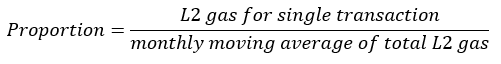
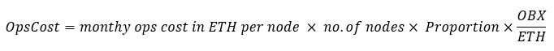
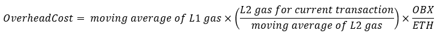
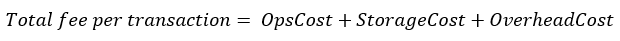
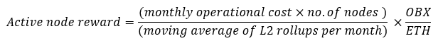

# Fees and Rewards

Obscuro sets out a simple structure for fees and rewards. End users pay fees based on their usage, which are placed into a pool from which rewards for nodes are paid out.

The structure delivers a steady and predictable income for node operators over the long term and a predictable fee for users proportional to the actual costs of running the network and does not rely on bidding wars or vary according to activity.

The structure also does not punish Aggregators that miss out on a publishing opportunity with slashing. Instead, the loss of reward should be incentive enough.

Since Obscuro does not link fees and rewards directly, the high-level goal of this mechanism is to find a stable equilibrium between the amounts paid into the pool by end-users and the amounts paid out to nodes for their service. In periods of high network usage, the pool will grow, and this extra money will be used in quiet periods to pay for publishing rollups more frequently, thus providing a better user experience. 

## Cost of L2 nodes

Operators run the network and incur operational costs by running and maintaining nodes.

An "expected monthly node operational costs" variable is set through the governance protocol, which is designed to reflect how much a node operator would pay for hardware, hosting etc, in a month. This is analogous to the proof of work difficulty found in other blockchains. This affects demand for running a node.

Aggregator nodes incur cost from submitting transactions to L1, through the following:

- Storing rollup data on Ethereum.
- The overhead of processing the L1 transaction that contains the rollup.

## Fee Per Transaction

The total fee a user must pay has three components.

1. A proportion of the monthly operational cost for all nodes. This is calculated based on the computation of the current transaction as a proportion of the moving average of all L2 transactions over the month. Represented as:

2. The cost incurred by nodes for L1 storage, represented as:

3. A proportion of the additional overhead cost incurred by nodes for processing rollups is as follows:

- At the point of transaction, it is impossible to know what the true cost of the future rollup is.
- Users need to pay their fair share of what this future rollup cost will be.
- The best indicator of what the future rollup cost might be is a moving average of the previous n rollups.
- Where n is high, the averaging is performed over a larger number of rollups and therefore less volatile and vice versa.
- The computation required by Obscuro nodes to run a transaction is estimated using a metering mechanism similar to the one found in Ethereum.
- Using this information, Obscuro calculates the share of each transaction from the total computation in an average block.
- The basis for calculating the L1 fee is the cost to publish an average rollup to L1.
- Each transaction pays a share of that cost proportional to its computation.

This gives the expected fee per transaction as:

## Rewards For L2 nodes

The Obscuro protocol rewards both Verifiers and Aggregators that monitor the network via a lottery. The lottery randomly rewards active nodes each round with an OBX reward for participating. Nodes prove they are alive by claiming their reward within the subsequent few blocks; else, the reward is burned. The reward in each rollup is calculated to cover the operational costs of these nodes.

Aggregator nodes have an additional reward mechanism that pays out rewards in OBX when having successfully published a rollup based on the rules of the POBI protocol. This reward covers at least the L1 gas costs incurred and will not be greater than double the L1 gas cost.

The lottery pay out amount per rollup round is represented as:

## Bootstrapping The Network

When the network first spins up, it is prudent to expect low transaction volume, which can create a situation where:

1. Aggregators can publish continually at a high cadence and absorb what might amount to a loss-making operation.
2. Aggregators can throttle the rate at which rollups are published, leading to a poorer user experience.
3. Alternatively, the network can subsidise early transactions allowing both groups to succeed.

While Obscuro optimises for end-users, early nodes should also be profitable. As such, Obscuro follows the path of option 3

In the early days of the network, fees will be subsidised by newly minted tokens to ensure early users do not face excessive fees. The price of a transaction is fixed at $1 in OBX until the Obscuro network is better established. For nodes, there is a period of subsidisation that reduces over time until transaction volume picks up.
