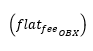
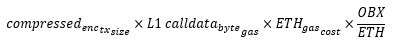
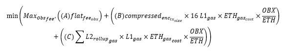
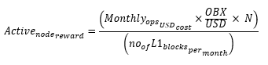
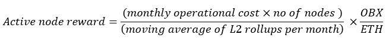

# Fees and Rewards

Obscuro sets out a simple structure for fees and rewards. End users pay fees based on their usage which are placed into a pool from which rewards for nodes are paid out.

The structure delivers a steady and predictable income for node operators over the long term and a predictable fee for users proportional to the actual costs of running the network and does not rely on bidding wars or vary according to activity.

The structure also does not punish Aggregators that miss out on a publishing opportunity with slashing. Instead, the loss of reward should be incentive enough.

## Cost of L2 nodes

Operators run the network and incur operational costs by running and maintaining nodes.

An "expected monthly node operational costs" variable is set through the governance protocol, which is designed to reflect how much a node operator would pay for hardware, hosting etc, in a month. This is analogous to the proof of work difficulty found in other blockchains. This effects demand for running a node.

Aggregator nodes incur cost from submitting transactions to L1, through the following:

- Storing rollup data on Ethereum.
- The overhead in participating in publishing rollups outside of the storage cost, e.g. signing transactions.

## Fee per transaction

The total fee a user must pay has three components.

1. A proportion of the monthly operational cost for all nodes. The proportion is calculated based on the computation of the current transaction as a proportion of the moving average of all L2 transactions over the month. Represented as:

2. The cost incurred by nodes for L1 storage, represented as:

3. A proportion of the additional overhead cost incurred by nodes for processing rollups is as follows:

The idea behind this is:

- At the point of transaction, it&#39;s impossible to know what the true cost of the future rollup is
- Users need to pay their fair share of what this future rollup cost will be
- The best indicator of what the future rollup cost might be is a moving average of the previous n blocks
- Where n is high, the cost is averaged out amongst more blocks and therefore less volatile and vice versa. High n adds more risk to Aggregators
- L2 gas can be computed as Obscuro has the same metering mechanism as L1. As a result of this metering, we can work out the gas consumed and directly map this to the L1 moving average gas cost

This gives the expected fee per transaction as:

##

## Rewards for L2 nodes

The Obscuro protocol rewards both Validators and Aggregators that actively monitor the network via a lottery. The lottery randomly rewards active nodes each round with an OBX reward for participating. Nodes prove they&#39;re alive by claiming their reward within the subsequent few blocks; else, the reward is burned. The reward in each rollup is calculated to cover the operational costs of active nodes.

Aggregator nodes have an additional reward mechanism that pays out rewards in OBX when they successfully win the right to validate and publish a rollup. This reward covers at least the L1 gas costs incurred.

The lottery pay out (active node reward) amount per rollup round is represented as:

- The lottery reward in each rollup is calculated to cover the operational costs of active nodes.

## Bootstrapping the network

##

When the network first spins up, it&#39;s prudent to expect low transaction volume. Low transaction volume creates a situation where:

1. Nodes can publish continually at a high cadence and absorb what might amount to a loss-making operation.
2. Nodes can throttle the rate at which rollups are published, leading to a poorer user experience.
3. Alternatively, the network can subsidize early transactions allowing both groups to succeed.

While Obscuro optimizes for end-users, early nodes should also be profitable. As such, Obscuro follows the path of option 3

- In the young days of the network, fees will be subsidized by newly minted tokens to ensure early users do not face excessive fees. The price of a transaction is fixed at $1 in OBX until OBX establishes a stable market.
- A period of subsidizing new nodes that reduces over time until transaction volume picks up and market forces take over.
