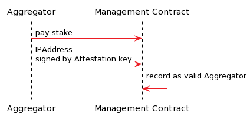

## Joining the TEN Network
Anyone wishing to join the TEN network as a Node must first check that their hardware is compatible with the latest Attestation Constraints. Next, they must download and install the latest software. Then they must perform the steps detailed below.

### Node Registration
The enclaves must encrypt L2 transactions with a secret key shared across the L2 nodes rather than an enclave-specific key which would be lost if an enclave is damaged.
Before obtaining the shared secret, the L2 nodes must attest that they are running a valid version of the contract execution environment on a valid CPU.

An L2 node invokes a method on the Network Management Contract to submit their attestation. Another L2 node (which already holds the secret key inside its enclave) responds by confirming the attestation and then updating this record with the shared secret encrypted using the public key of the new node. Whichever existing L2 node replies first, signed by the enclave to guarantee knowledge of the secret, gets a reward. This solves two problems: 
1. The Network Management Contract provides a well-known central registration point on a decentralised L1 network that stores the L2 shared secret in public.
2. Existing L2 nodes are compensated for their infrastructure and L1 gas costs to onboard new nodes.

The sequence for node registration is shown in the following diagram:

1. Any L2 node must register with the Network Management Contract. The node supplies its TEE attestation. It also must pay a fee for the service of receiving the shared secret. If the node wants to be an Aggregator, it has to pay the required stake. The first L2 node to register is responsible for setting up a shared secret from which the entropy for all further secrets is derived.
2. The first L2 node generates a secret and encrypts it with its enclave specific public key to store. It then submits these secrets to the Management Contract, which stores this encrypted secret and registers the public key of the newly formed network. This is covered further in [Cryptography](./cryptography).
3. A new party wishing to become an L2 node uses the Network Management Contract to submit the remote attestation object, which signals to the network that it wants to know the shared secret. The Network Management Contract checks the attestation against the current attestation rules. Existing nodes are incentivised to respond with the encrypted secret. Any node with a valid TEE able to pass the attestation can receive the key from another node.
4. The new node begins executing all the transactions already published to the Rollup Management Contract to synchronise its internally cached state with the other nodes. This includes user deposits and withdrawals into the Bridge contract, as well as confirmed user transactions.

If all L2 nodes go offline, smart contract execution is delayed and resumed when the first node goes online.
If all L2 nodes are destroyed along with their enclave-derived key pairs, the shared secret key is lost, and the confidential contract state can never again be processed. As long as one L2 node remains bootable and can recreate its enclave-derived key, it may decrypt the shared secret and share it with other nodes. The incentives must ensure that there is enough geographical distribution to make this scenario impossible.

### Attestation Verification
The above solution assumes that attestation verification can be implemented efficiently as part of the Network Management Contract. This is the ideal solution since it makes the contract the root of trust for the L2 network. Furthermore, the governance mechanism of the Management Contract controls the attestation requirements, like the hash of the program.

### Aggregator Registration
An Aggregator is a special type of L2 node which has the power to be a sequencer in some rounds and submit rollups.

In addition to node registration, there is an additional step of pledging a stake.

The sequence for node registration is shown in the following diagram:

These are the steps to becoming an Aggregator.
* Register with the L1 Network Management Contract and pay a significant stake in the TEN token. The stake has multiple roles. The first one is to penalise Aggregators who attempt to hack the protocol, and the second is for the Aggregators to buy into the ecosystem and make an effort to keep it running smoothly.
* Set up a server with a valid, unaltered, up-to-date and secured TEE and provide an attestation from the hardware manufacturer or a delegate to the Management Contract.
* On seeing this request to join the network published to the L1, another registered TEE shares the secret to encrypt and decrypt user transactions.
* Once in possession of the secret, the TEE can start processing all the L2 transactions stored on the L1 blockchain and build the state.
* Upon completion, the new Aggregator can join the gossip with the other Aggregators and participate in the lottery for producing rollups.
* Some end users send encrypted instructions directly to this node server. The node gossips these with other nodes in the L2 network, encrypted with the shared secret.
* As Aggregators process messages, they maintain the L2 state in the encrypted TEE memory or encrypted in a local database. Then, if they are the lottery winner, they create a valid rollup and publish it to L1 when the time comes.
* All Aggregators keep track of the blocks submitted to the Management Contract to ensure they are up-to-date with the source of truth.
* The first Aggregator to register has a unique role, as it has to create the shared secret.

Note: Each Aggregator needs an ETH balance on the L1 to pay for the submission of the rollup.
