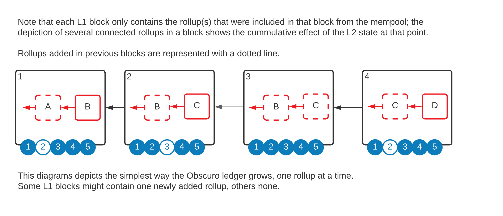
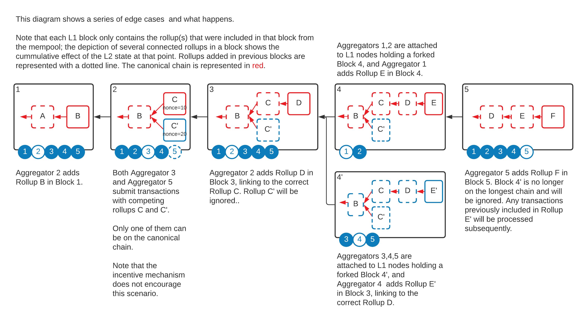

## Rollup Data Structure
The Management Contract implements a blockchain-like data structure to store the rollups. Each rollup points to a parent rollup, and at any time there can be multiple competing sibling rollups. Similar to L1 blockchains, it is the responsibility of the individual L2 nodes to decide which sibling is valid. The difference is that un-hacked nodes are running the same code and thus are not able to build upon an invalid rollup, or even to build on different rollups.

The diagram below depicts an L1 blockchain (in black). Each block contains a snapshot of the state of the TEN rollup chain (in Red). In this example, there are 5 TEN nodes.

Note that forks are possible on both layers, and it is the responsibility of the TEN nodes to navigate and choose the most likely L1 block. The following diagram depicts a couple of complex scenarios, where firstly an extra Aggregator publishes an additional rollup to a block, and secondly the L1 chain forks. 

Note that this diagram will be dissected more after we introduce the consensus protocol. At this moment, it intends to give a high-level mental model of the decentralised nature of the L2 data model on top of the decentralised nature of the L1.
 