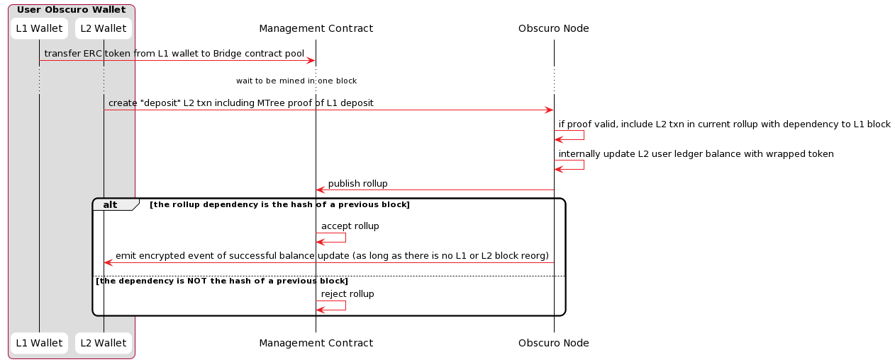
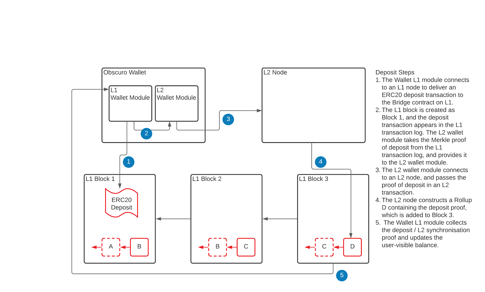
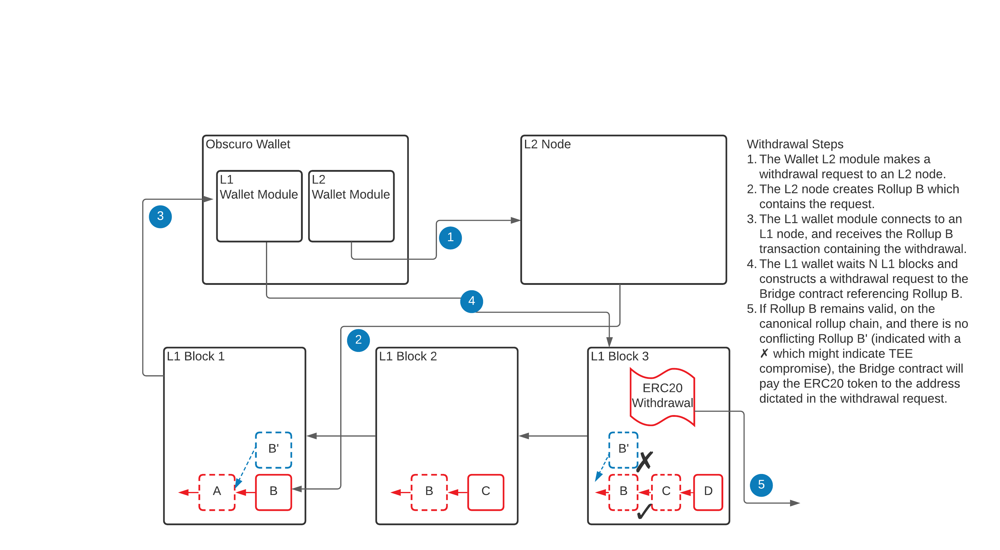

# TEN and Ethereum Interaction
TEN is a confidential extension to Ethereum, and thus assets have to move freely between the two networks.

All sidechains and L2 solutions have developed solutions to the mismatches between the different models of the two networks, and typically there is a bridge contract that safeguards assets.
The difference between sidechains and L2 solutions is that mismatches are more significant for sidechains because they have their own finality and security mechanisms, and thus the bridge logic is either very complex or centralised.

## Deposits
The user deposits supported ERC tokens into the well-known address of the Bridge contract, and once the transaction is successfully added to a block, the TEN-enabled wallet automatically creates an L2 transaction, including proof of the L1 transaction. The exact amount is credited with wrapped tokens on the user's account on TEN. 

The fact that the finality of L1 transactions is probabilistic makes crediting the L2 account not straightforward. Most solutions solve this problem by waiting for a confirmation period before crediting the account. TEN takes a different approach and introduces a dependency mechanism between the L2 rollup and the L1 blocks.

The rule is that the L2 rollup that includes the transaction that credits the TEN account has a hard dependency on an L1 block, and the Bridge contract enforces that it is one of the ancestors of the current block. If the L1 deposit transaction is no longer in the canonical L1 chain, it automatically invalidates the rollup that contains the L2 deposit transaction, and the L1 deposit will only be recognised as the basis for an L2 rollup credit transaction when it has been included in the canonical L1 chain.

The interaction is shown in the following diagram:

See also the [Data model](./appendix#data-model) section and the following dependency diagram.

_Note: The deposit L2 transaction cannot be fully encrypted because the Aggregator has to decide whether to include it in the current rollup based on the chances of the L1 block it depends on being final._

## Withdrawals
The high-level requirement for the withdrawal function is simple: allow TEN users to move assets back into the Ethereum network. The problem is that this is where the most significant threat against such a solution lies because there might be a large amount of locked value.

The challenge is to implement this functionality in a decentralised way by defining a protocol and economic incentives.

Due to the sensitivity of this function, many sidechains and L2 solutions rely on multi-signature technology to control the release of funds. Optimistic Rollups rely on a challenge mechanism during a long waiting period before releasing funds, powered by economic incentives.

TEN uses TEE technology, but it cannot leverage it for this aspect because of our threat model. The Bridge Contract could release funds based on a signature from an attested TEE if it were invulnerable, but since that is not the case, the solution is to use economic incentives on top of the POBI protocol.

### Rollup Finality
The general rule is that withdrawals can be processed only when a rollup is _final_. This means this is the protocol for the finality of the TEN chain relative to the Ethereum chain.

#### Rule 1 - The standard delay period
In the usual case, a rollup from the canonical chain (see POBI protocol) is final if a standard number of blocks corresponding to a period of 1 day has passed from the Ethereum block where it was published.
- Note 1: The period is measured in Ethereum blocks because the delay is stable on average between blocks.
- Note 2: The reason for this period is to give honest nodes the chance to "challenge" the rollup if it is malicious.
- Note 3: The period is inverse to the number of L2 nodes. It should be long enough to give honest participants the chance to react and publish in the face of aggressive censorship attempts against them, but short enough not to degrade the user experience. We estimate that once the network reaches a healthy number of nodes, we can reduce it to 50-100 blocks (~ 10 minutes).

#### Rule 2 - The competing forks
Assuming the period chosen at rule #1 is enough, the only possible write attack performed by an actor that could hack the TEE manifests as multiple parallel forks at least two rollups deep. This is because all valid TEEs run the same attested code that chooses the same canonical chain from the rollups published in the L1 block presented as proof. If the Management Contract notices multiple forks, the rule is that finality is suspended on all forks, thus, withdrawals are suspended. Likewise, if one of the forks becomes inactive, the rule is that all rollups on the alive fork become final once a standard period of 1 day has passed from the last L1 block that contained a rollup published on the inactive branch.

- Note1: This rule degrades a _write-attack_ into a Denial of Service attack on the withdrawal function.
- Note2: Assuming there are honest participants, the actual canonical ledger keeps growing, including user transactions.
- Note3: The attacker has to spend Ethereum gas to keep the malicious fork alive.

#### Rule 3 - addressing the DoS on finality
Since rule #2 transforms any attack into a DoS attack, the protocol has some mechanisms to keep user experience satisfactory even in the extreme case of a TEE hack.

1. The ultimate backstop is the "Attestation Constraints" rules. Forks in the canonical chain are clearly a breach of protocol, caused either by a TEE hack or a protocol hack. This is ultimately resolved with software or, at worst, hardware updates. Once the management Contract forces an upgrade, the attacker will no longer be able to create malicious rollups, and thus the fork becomes inactive, and finality resumes on the valid fork.

2. For any users with an L2 node, it is obvious which is the canonical chain, as it is the one that does not fail. Market makers operating on both L1 and L2 can step in and absorb the withdrawal requests of users at a slight discount without taking any actual risk.

The above rules will, in practice, prevent this type of attack, and if it happens, offer a practical solution for users. In addition, the protocol has yet another backstop to address the extreme case of a very persistent attacker.

The network governance model allows any user to trigger the _forced finality procedure_ by staking or voting on one of the competing rollup chains. The minimum stake is a percentage of the amounts being withdrawn on that branch, set through governance. Backers of the other chain are obliged to stake a similar or higher value to compete. The decision process is run as an auction, where the party that loses also loses their bids. When concluded, all rollups on that chain are considered final, and withdrawals are executed.

### Withdrawals protocol
Each TEE signed rollup contains a plaintext list of withdrawal requests. See: [Data Model](./appendix#data-model).

The Bridge contract keeps track of these requests and executes them at different times, based on the finality status of that rollup.

The withdrawal process is indicated in the following diagram:

## TEN public events

Ethererum application developers can use a confidential L2 like TEN for some jobs that are not possible otherwise.

For example, an L1 smart contract organises a fair lottery that needs a reliable random number generator that the miners cannot game.

Another example is publishing the result of a poker game played inside TEN, which the L1 contract can use to make a payment or update the tournament results.

The challenge for achieving this functionality is that the data originating in L2 has to be final.
Luckily TEN has this mechanism already in place for processing withdrawals.
Applications running inside TEN can emit special types of events called _Public Events_, which the OVM will add in plaintext into a dedicated data structure in the rollup.
The _Rollup Contract _ first processes the rollup, and then once they reach finality, it exposes these events to external contracts.

Note: The fair lottery can be implemented in two steps to avoid any possible influence. The implementation can use the submarine technique and first publish the hash of that number in an event, and a few blocks later publish the actual number in a different event.
