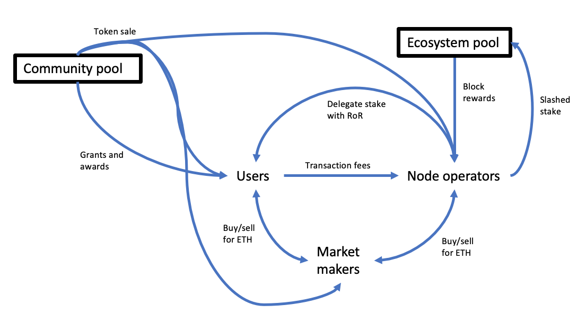

# Tokenomics
The TEN network requires the participation of several types of actor, some of whom incur costs in performing their roles and need to be remunerated. Furthermore, the system's security depends, in part, on the ability to economically punish those who can be proved, within the protocol, to have acted maliciously. This is achieved through a traditional staking model, and a digital asset, OBX, is used for these purposes.  In what follows, the functions such a token performs in the system, the game-theoretic requirements with respect to Sybil-resistance, broad allocation and stakeholder incentivisation, and how the minting and distribution of the token have been designed to achieve these ends is outlined.  Readers only interested in the technical design of the platform may skip this section.

The main goals for the creation of the OBX token are to provide a truly decentralised network and sustainable growth of the network. That means creating an equally attractive system to developers, TEN node operators, end-users, enterprises, and the wider community. The OBX token will be issued as a utility token and not a regular coin or security.  The token has four primary uses:

* During bootstrapping, to provide an inflationary _block reward_ to incentivise users to operate TEN nodes.
* A medium in which users can pay fees and node operators receive rewards.
* A means to fund the ongoing development of the TEN platform.
* A way to incentivise eco-system development via grants and competitions.

The OBX token is issued initially onto Ethereum Mainnet as an ERC-20 token. This is because it is easier to bootstrap adoption onto an already existing network with financial infrastructure such as exchanges and other existing DeFi applications. The intention is that the OBX token is not issued until the first release of the TEN platform is substantially complete. In other words, it should be possible to use TEN in a testnet environment as a pre-requisite for the utility token launch to proceed.

On TEN entering production, an allocation of tokens for Aggregator rewards will be issued directly onto the TEN network. Therefore, there are two classes of token: Ethereum native and TEN native, and participants can move seamlessly between them using the TEN Bridge Contract.

## Relationship to ETH
In order to publish TEN rollups to Ethereum Mainnet, TEN Aggregators must hold a balance of ETH. Aggregators get paid in OBX (via block reward and transaction fees) and have outgoings in ETH; therefore, there exists currency exposure between OBX and ETH, which, in theory, can be hedged with futures or options if such a market existed. The combination of transaction fees and block reward in terms of ETH must be large enough to:
* Cover the ETH required to publish the latest TEN block to Ethereum Mainnet.
* Cover the TEN computation required to validate and publish the block.

It is thus essential for the OBX/ETH relationship to remain as stable as possible. The incentives of the various groups involved in the network should be able to facilitate this. To participate in the network or become an Aggregator, users must have OBX tokens. Aggregator behaviour is incentivised by a [fees and rewards](./fees-rewards) structure.

Gas is accounted for in the same way that Ethereum does and with a market for OBX gas based upon the supply and demand determined by TEN node operators. Clearly, income of OBX _in ETH terms_ to an Aggregator must be greater than the ETH they require to publish the block to Ethereum Mainnet.

## Illustrated flows

Over time the community pool decreases in size. Likewise, the eco-system pool also decreases in size. However, the amount of tokens held by the community (users, market makers and node operators) increases in size. Likewise, the team pool decreases in size over time as tokens are sold to fund development.
